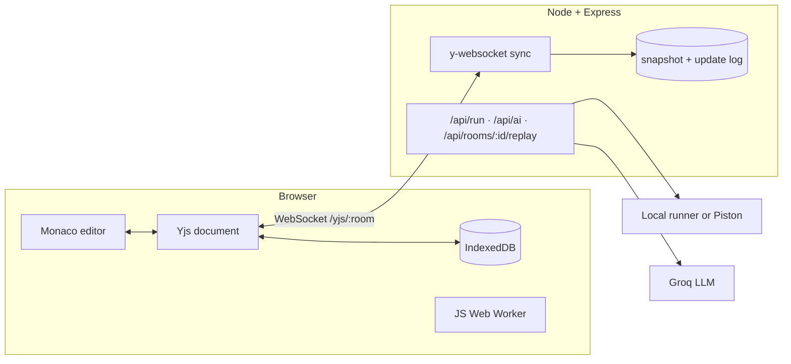

<div align="center">

# CodeFusion

**Write code together, at the same time.**
A real-time collaborative code editor with conflict-free sync, shared code execution, an in-room AI assistant and session replay.

[](https://github.com/SonamNarula/CodeFusion-a-collaborative-real-time-code-editor/actions/workflows/ci.yml)


</div>

---

## Why this exists

Most "collaborative editors" built with Socket.io send the whole document on every keystroke. When two people type at once, the last message wins and someone's work disappears.

CodeFusion uses **CRDTs (Yjs)** instead. Every edit is a small, mergeable operation, so concurrent edits from any number of people converge to the same result, even after being offline. On top of that sync layer it adds the things you actually need when pairing or interviewing: running the code, asking an AI about it, and replaying how it was written.

## Features

| Feature | What it does |
|---|---|
| **Conflict-free sync** | Two people typing at the same spot both keep their edits. No locking, no overwrites. |
| **Offline-first** | Disconnect, keep editing, reconnect: changes merge. A local IndexedDB copy survives refreshes. |
| **Live presence** | Named, coloured cursors and selections, typing indicators, participant list. |
| **Follow mode** | Click *Follow* on a person to scroll along with their cursor. |
| **Shared code execution** | JavaScript runs in a Web Worker in your browser (5 s limit). Python, C and C++ run on the server, or on any [Piston](https://github.com/engineer-man/piston) instance. Output is visible to the whole room. |
| **AI pair-programmer** | *Explain*, *Review*, *Fix bugs*, *Write tests*, or `/ai <question>`. The answer lands in the shared chat. Powered by Groq. |
| **Session replay** | Every update is stored with a timestamp. Scrub or play back how the file was written. |
| **Interview mode** | The host can lock editing to view-only and start a shared countdown timer. |
| **Persistent rooms** | Room state is snapshotted to disk and survives server restarts. |
| **Polish** | Invite link in one click, download the file, light and dark themes, responsive layout, offline banner. |

<div align="center">

<br><sub>Session replay: scrub through the history of a room.</sub>
</div>

## How it works



**One Yjs document per room** holds everything that must stay in sync:

| Shared type | Contents |
|---|---|
| `code` (`Y.Text`) | The file being edited |
| `meta` (`Y.Map`) | Language, host, lock state, timer, AI-busy flag |
| `chat` (`Y.Array`) | Chat messages and AI replies |
| `run` (`Y.Map`) | The latest execution result, so everyone sees the same output |

Presence (name, colour, cursor, typing) travels over Yjs *awareness*, which is ephemeral and never written to disk.

**Persistence.** For each room the server writes a compacted snapshot (`<room>.ydoc`, debounced to once per second) and appends every update to a JSONL log (`<room>.log`) with a timestamp. The snapshot restores the room after a restart; the log powers session replay. The replay view rebuilds the document by applying logged updates up to the slider position.

**Execution.** JavaScript never leaves your browser: it runs in a throwaway Web Worker that is terminated after 5 seconds. Other languages go through `POST /api/run`, which uses either a Piston instance (`PISTON_URL`) or the server's local toolchain, with a time limit, an output cap and a per-IP rate limit.

## Tech stack

| Layer | Choice |
|---|---|
| Client | React 18, Vite, React Router, plain CSS |
| Editor | Monaco (bundled locally, no CDN), `y-monaco` binding |
| Sync | Yjs, `y-websocket`, `y-indexeddb` |
| Server | Node.js, Express, `ws`, `express-rate-limit` |
| AI | Groq API (OpenAI-compatible endpoint) |
| Tooling | Node test runner, GitHub Actions, Docker |

## Quick start

Requires **Node 18+**.

```bash
git clone https://github.com/SonamNarula/CodeFusion-a-collaborative-real-time-code-editor.git
cd CodeFusion-a-collaborative-real-time-code-editor
npm install
cp .env.example .env      # optional: add GROQ_API_KEY to enable the AI
npm run dev               # client on :5173, server on :5050
```

Open **http://localhost:5173**, create a room, then open the invite link in a second browser window and type in both.

Production-style build served by a single Node process:

```bash
npm run build && npm start      # http://localhost:5050
```

## Configuration

| Variable | Default | Purpose |
|---|---|---|
| `PORT` | `5050` | Server port |
| `DATA_DIR` | `server/data` | Room snapshots and replay logs |
| `CLIENT_URL` | any origin | Allowed origin(s), comma separated. Only needed if the client is hosted elsewhere |
| `GROQ_API_KEY` | none | Enables the AI assistant |
| `GROQ_MODEL` | `llama-3.3-70b-versatile` | Model used for AI replies |
| `PISTON_URL` | none | Use a Piston server for Python, C, C++, Java, Go, Rust, TypeScript |
| `ENABLE_LOCAL_EXEC` | `true` in dev, `false` in prod | Run Python/C/C++ with the server's own toolchain |
| `VITE_SERVER_URL` | same origin | Client build option when the API lives on another host |

## Deployment

**Docker**

```bash
docker compose up --build        # http://localhost:5050, data persisted in the cfdata volume
```

**Render, Railway, Fly.io**: deploy the repo using the included `Dockerfile`, expose port 5050 and mount a persistent volume at `/data`. The server serves the built client itself, so there is no CORS setup. WebSockets work out of the box on these platforms.

If you host the client separately (for example on Vercel), set `VITE_SERVER_URL` at build time and `CLIENT_URL` on the server.

## Security notes

- Room ids are validated (`[A-Za-z0-9_-]{4,64}`) on both the HTTP and WebSocket paths; WebSocket frames are capped at 1 MB.
- `run`, `ai` and `replay` endpoints are rate limited per IP; request bodies are size limited.
- Remote usernames are sanitised before being used in injected cursor CSS.
- **`ENABLE_LOCAL_EXEC` is not a sandbox.** It runs code with a timeout and output cap, but with the server's own permissions. Use it on your own machine only. For a public deployment use `PISTON_URL`, or leave execution to the browser (JavaScript).
- Rooms are protected by an unguessable link, not by accounts. Anyone with the link can join.

## API

| Endpoint | Description |
|---|---|
| `WS /yjs/:room` | Yjs sync and awareness |
| `GET /api/config` | Which languages can run, and whether AI is enabled |
| `POST /api/run` | `{ language, code, stdin }` returns `{ stdout, stderr, code }` |
| `POST /api/ai` | `{ mode, code, language, prompt, output }` returns `{ text }` |
| `GET /api/rooms/:room/replay` | Timestamped Yjs updates for replay |
| `GET /api/health` | Liveness check |

## Testing

```bash
npm test          # 8 integration tests against a real server and real Yjs clients
npm run bench     # propagation latency with N clients (CLIENTS=20 EDITS=200 npm run bench)
```

The tests cover: convergence after concurrent edits made while disconnected, late joiners receiving the document, rooms surviving a server restart, the replay log, room-id validation, and the code runner including its time limit.

On a laptop over loopback with 10 clients and one typing, the benchmark reports a p50 and p95 of about 21 ms. The benchmark polls every 20 ms, so treat that as an upper bound for local conditions; real networks add their own round trip.

## Project structure

```
client/src
  pages/         Home, Room
  components/    CodeEditor (Monaco + Yjs binding, remote cursors), Sidebar (people, chat, AI),
                 Topbar, OutputPanel, ReplayModal
  hooks/         useCollab (document, provider, IndexedDB, presence)
  lib/           api, jsRunner (Web Worker), languages, user
server/src
  server.js      Express app, rate limits, WebSocket upgrade
  persistence.js Snapshot and replay log
  runner.js      Local and Piston execution
  ai.js          Groq client
server/test      Integration tests and benchmark
```

## Roadmap

- [ ] Multi-file projects and a file tree
- [ ] Accounts and saved rooms
- [ ] Voice chat over WebRTC
- [ ] Per-room permissions beyond the host lock
- [ ] Streaming AI responses

## Contributing

Issues and pull requests are welcome.

```bash
git checkout -b feat/your-idea
npm test && npm run build
git commit -m "feat: your idea"
```

## Author

Built by **Sonam Narula** · [GitHub](https://github.com/SonamNarula)

## License

MIT, see [LICENSE](LICENSE).
