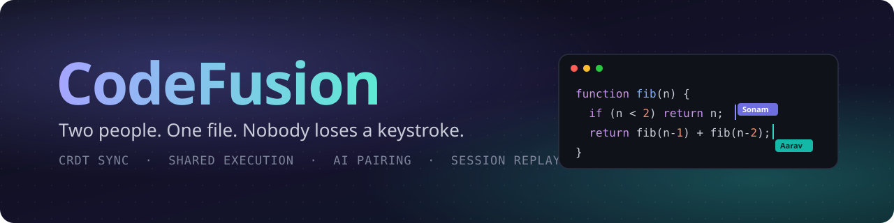
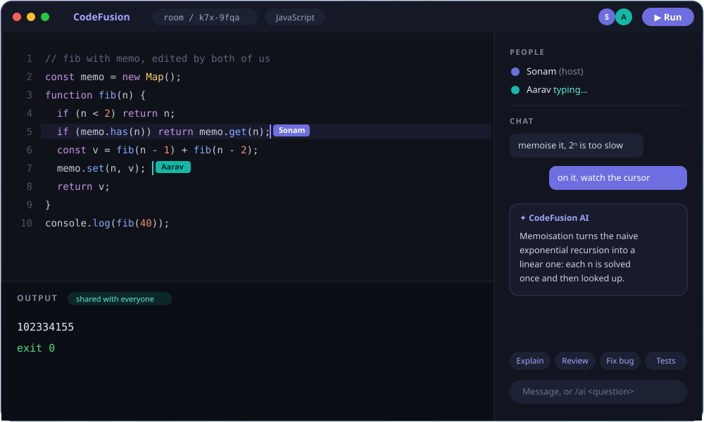
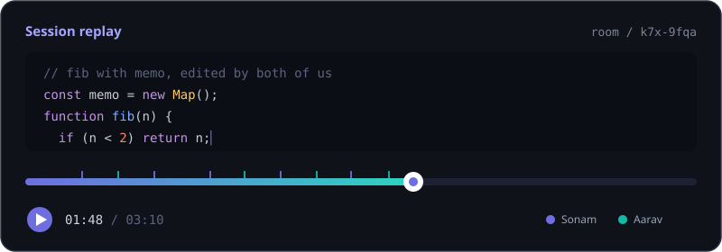
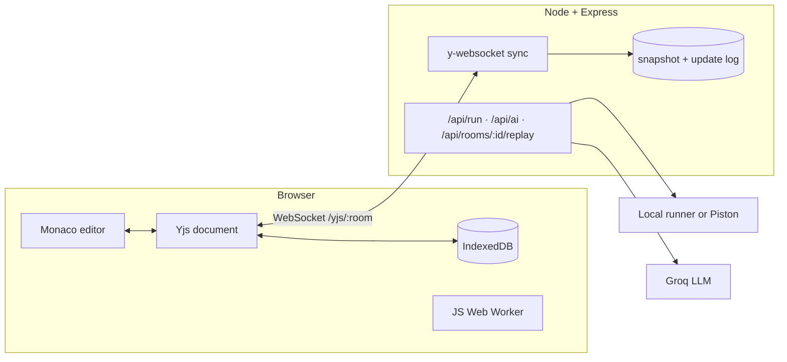

<div align="center">



<br>

[](https://github.com/SonamNarula/CodeFusion-a-collaborative-real-time-code-editor/actions/workflows/ci.yml)


**[Features](#-what-it-does) · [Quick start](#-try-it-in-two-minutes) · [How it works](#-how-it-works) · [Security](#-security-notes) · [Roadmap](#-roadmap)**

<br>



<sub>Two cursors, one file, shared output, an AI reply in the chat. (Illustrative mock-up of the room.)</sub>

</div>

<br>

## 🧩 The problem with most "collaborative editors"

The usual tutorial recipe is Socket.io plus a `text-change` event. It's lovely with one person typing. Put two people on the same line and the last message to arrive wins; the other person's work quietly vanishes. Lose your connection for a minute and it gets worse.

CodeFusion doesn't send documents. It sends *operations*. Every edit is a small, mergeable change tracked by [Yjs](https://github.com/yjs/yjs), a CRDT library, so any number of people can type at the same spot, disconnect, reconnect, and still land on the same text. No locks, no "someone else is editing" banners, no overwrites.

Around that core sits what you actually want while pairing or interviewing: run the code, ask an AI about it, and scrub back through how it was written.

<br>

<div align="center">

| **0** | **8** | **~21 ms** | **8** |
|:---:|:---:|:---:|:---:|
| overwritten keystrokes | integration tests<br>(real server, real clients) | p95 propagation, 10 clients<br>on loopback | languages in the editor |

</div>

<br>

## ✨ What it does

<table>
<tr>
<td width="33%" valign="top">

### 🔀 Conflict-free sync
Concurrent edits from any number of people converge. Nothing is overwritten, nothing is locked.

</td>
<td width="33%" valign="top">

### 📴 Offline-first
Keep typing while disconnected; changes merge on reconnect. An IndexedDB copy survives refreshes.

</td>
<td width="33%" valign="top">

### 👥 Live presence
Named, coloured cursors and selections, typing indicators, a participant list.

</td>
</tr>
<tr>
<td valign="top">

### ▶️ Shared execution
JavaScript runs in a Web Worker in your browser (5 s limit). Python, C and C++ run on the server; with [Piston](https://github.com/engineer-man/piston) you also get Java, Go, Rust and TypeScript. Output shows up for the whole room.

</td>
<td valign="top">

### 🤖 AI pair-programmer
*Explain*, *Review*, *Fix bugs*, *Write tests*, or `/ai <question>`. Replies land in the shared chat. Powered by Groq.

</td>
<td valign="top">

### ⏪ Session replay
Every update is timestamped. Drag a slider and watch the file being written, one keystroke at a time.

</td>
</tr>
<tr>
<td valign="top">

### 🎯 Interview mode
The host can lock the room to view-only and start a shared countdown timer.

</td>
<td valign="top">

### 💾 Persistent rooms
State is snapshotted to disk and survives server restarts.

</td>
<td valign="top">

### 🧭 Follow mode
Click *Follow* on someone and your viewport rides along with their cursor. Plus one-click invites, file download and light/dark themes.

</td>
</tr>
</table>

<div align="center">
<br>

<br><sub>Session replay: scrub through the history of a room.</sub>
</div>

<br>

## 🚀 Try it in two minutes

You need **Node 18+**.

```bash
git clone https://github.com/SonamNarula/CodeFusion-a-collaborative-real-time-code-editor.git
cd CodeFusion-a-collaborative-real-time-code-editor
npm install
cp .env.example .env      # optional: add GROQ_API_KEY to switch the AI on
npm run dev               # client on :5173, server on :5050
```

Open **http://localhost:5173**, create a room, then paste the invite link into a second browser window. Type in both at once. That's the whole demo.

A production-style build, served by one Node process:

```bash
npm run build && npm start      # http://localhost:5050
```

<br>

## 🔬 How it works



**One Yjs document per room** carries everything that has to stay in agreement:

| Shared type | Holds |
|---|---|
| `code` (`Y.Text`) | The file being edited |
| `meta` (`Y.Map`) | Language, host, lock state, timer, AI-busy flag |
| `chat` (`Y.Array`) | Chat messages and AI replies |
| `run` (`Y.Map`) | The latest execution result, so everyone sees the same output |

Presence (name, colour, cursor, typing) rides on Yjs *awareness*: ephemeral by design, never written to disk.

### Decisions worth explaining

> **Why is the run result inside the shared document?**
> So output is just another synced value. Whoever presses Run, everyone sees the same thing, and late joiners get it for free.

> **Why does JavaScript run in the browser?**
> Untrusted code on your own machine, inside a throwaway Worker killed after 5 seconds, is a far smaller risk than untrusted code on my server. Other languages must go through the backend, so they get more guardrails (see [Security](#-security-notes)).

> **Why two files per room on disk?**
> A compacted snapshot (`<room>.ydoc`, debounced to once a second) brings a room back after a restart. An append-only JSONL log (`<room>.log`) records every update with a timestamp and powers replay: the viewer rebuilds the document by applying logged updates up to the slider position.

<br>

## 🧰 Tech stack

| Layer | Choice |
|---|---|
| **Client** | React 18, Vite, React Router, plain CSS |
| **Editor** | Monaco, bundled locally (no CDN), bound with `y-monaco` |
| **Sync** | Yjs, `y-websocket`, `y-indexeddb` |
| **Server** | Node.js, Express, `ws`, `express-rate-limit` |
| **AI** | Groq API (OpenAI-compatible endpoint) |
| **Tooling** | Node test runner, GitHub Actions, Docker |

<br>

## 🛡️ Security notes

> [!WARNING]
> **`ENABLE_LOCAL_EXEC` is not a sandbox.** It applies a timeout, an output cap and a stripped environment, but the code still runs with the server's own permissions. Use it on your own machine only. For anything public, point `PISTON_URL` at an isolated executor, or let people run JavaScript in the browser and nothing else.

- Room ids are validated (`[A-Za-z0-9_-]{4,64}`) on both the HTTP and WebSocket paths; WebSocket frames are capped at 1 MB.
- `/api/run`, `/api/ai` and the replay endpoint are rate limited per IP (20, 12 and 30 requests a minute). Request bodies are size limited, and code over 50,000 characters is rejected.
- Remote usernames are sanitised before being used in injected cursor CSS.
- Rooms are protected by an unguessable link, not by accounts. Anyone holding the link can join.

<br>

## ⚙️ Configuration

<details>
<summary><b>Environment variables</b></summary>

<br>

| Variable | Default | Purpose |
|---|---|---|
| `PORT` | `5050` | Server port |
| `DATA_DIR` | `server/data` | Room snapshots and replay logs |
| `CLIENT_URL` | any origin | Allowed origin(s), comma separated. Only needed if the client is hosted elsewhere |
| `GROQ_API_KEY` | none | Enables the AI assistant |
| `GROQ_MODEL` | `llama-3.3-70b-versatile` | Model used for AI replies |
| `PISTON_URL` | none | Use a Piston server for Python, C, C++, Java, Go, Rust, TypeScript |
| `ENABLE_LOCAL_EXEC` | `true` in dev, `false` in prod | Run Python/C/C++ with the server's own toolchain |
| `VITE_SERVER_URL` | same origin | Client build option when the API lives on another host |

</details>

<details>
<summary><b>API reference</b></summary>

<br>

| Endpoint | Description |
|---|---|
| `WS /yjs/:room` | Yjs sync and awareness |
| `GET /api/config` | Which languages can run, and whether AI is enabled |
| `POST /api/run` | `{ language, code, stdin }` returns `{ stdout, stderr, code }` |
| `POST /api/ai` | `{ mode, code, language, prompt, output }` returns `{ text }` |
| `GET /api/rooms/:room/replay` | Timestamped Yjs updates for replay |
| `GET /api/health` | Liveness check |

</details>

<details>
<summary><b>Project structure</b></summary>

<br>

```
client/src
  pages/         Home, Room
  components/    CodeEditor (Monaco + Yjs binding, remote cursors), Sidebar (people, chat, AI),
                 Topbar, OutputPanel, ReplayModal
  hooks/         useCollab (document, provider, IndexedDB, presence)
  lib/           api, jsRunner (Web Worker), languages, user
server/src
  server.js      Express app, rate limits, WebSocket upgrade
  persistence.js Snapshot and replay log
  runner.js      Local and Piston execution
  ai.js          Groq client
server/test      Integration tests and benchmark
```

</details>

<br>

## 🐳 Deployment

**Docker**

```bash
docker compose up --build        # http://localhost:5050, data kept in the cfdata volume
```

**Render, Railway, Fly.io:** deploy from the included `Dockerfile`, expose port 5050, and mount a persistent volume at `/data`. The server serves the built client itself, so there's no CORS to configure, and WebSockets work out of the box.

Hosting the client separately (Vercel, say)? Set `VITE_SERVER_URL` at build time and `CLIENT_URL` on the server.

<br>

## 🧪 Testing

```bash
npm test          # 8 integration tests, real server and real Yjs clients
npm run bench     # propagation latency with N clients (CLIENTS=20 EDITS=200 npm run bench)
```

The tests don't mock the network. They cover convergence after concurrent edits, late joiners receiving the document, rooms surviving a server restart, the replay log, room-id validation, and the code runner including its time limit (the Python runner test is skipped if `python3` isn't installed).

On a laptop over loopback with 10 clients and one typing, the benchmark reports a p50 and p95 of about 21 ms. The benchmark polls every 20 ms, so read that as an upper bound for local conditions; a real network adds its own round trip.

<br>

## 🚧 Known limits

Being upfront about what this doesn't do yet:

- One file per room. No project tree.
- No accounts, so no ownership beyond the host flag stored in the room.
- AI replies arrive whole rather than streaming.
- The replay log is capped at 20,000 events per room.

## 🗺️ Roadmap

- [ ] Multi-file projects and a file tree
- [ ] Accounts and saved rooms
- [ ] Voice chat over WebRTC
- [ ] Per-room permissions beyond the host lock
- [ ] Streaming AI responses

## 🤝 Contributing

Issues and pull requests are welcome.

```bash
git checkout -b feat/your-idea
npm test && npm run build
git commit -m "feat: your idea"
```

<br>

---

<div align="center">

Built by **Sonam Narula** · [GitHub](https://github.com/SonamNarula) · [LinkedIn](https://linkedin.com/in/sonamnarula)

MIT licensed, see [LICENSE](LICENSE).

</div>
