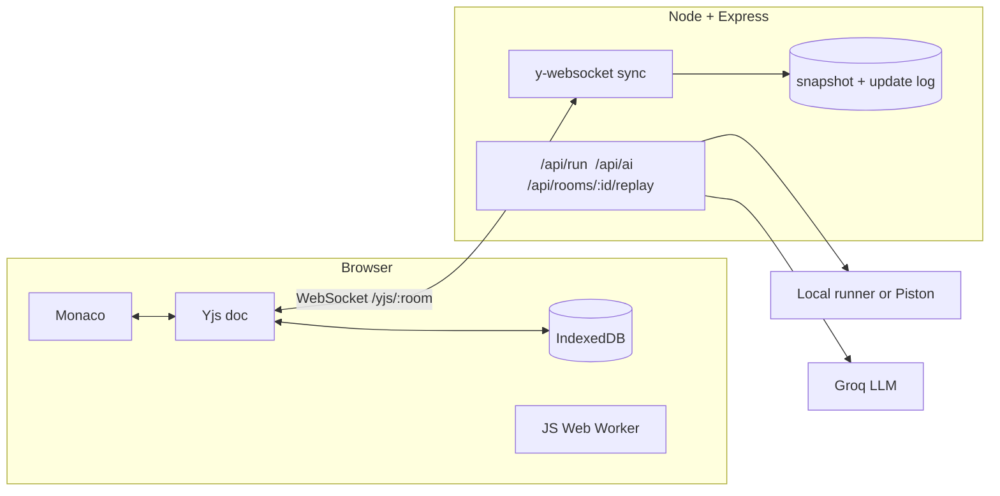

# CodeFusion

**Real-time collaborative code editor.** Open a room, share the link, and edit one file together. Run it, ask an AI about it, and replay the whole session afterwards.

Built with React, Monaco, Yjs (CRDT), Node and WebSockets.

<!-- Add a demo GIF here: docs/demo.gif -->

## Features

| | |
|---|---|
| **Conflict-free sync** | Yjs CRDTs replace last-write-wins. Two people typing at the same spot both keep their edits. |
| **Offline-first** | Disconnect, keep editing, reconnect: changes merge. A local IndexedDB copy survives refreshes. |
| **Live presence** | Named, coloured cursors and selections, typing indicators, and a participant list. |
| **Follow mode** | Click *Follow* on a person to scroll along with their cursor. |
| **Run code** | JavaScript runs in a Web Worker in your browser (5 s limit). Python, C and C++ run on the server, or on any [Piston](https://github.com/engineer-man/piston) instance. Output is shared with the room. |
| **AI pair-programmer** | Explain, review, fix bugs, write tests, or `/ai <question>`. Answers appear in the shared chat for everyone. Uses the Groq API. |
| **Session replay** | Every update is logged with a timestamp. Scrub or play back how the file was written. |
| **Interview mode** | The host can lock editing to view-only and start a shared countdown timer. |
| **Persistent rooms** | Room state is snapshotted to disk and survives server restarts. |
| **Share and export** | One-click invite link, download the file, light and dark themes. |

## Architecture



One Yjs document per room holds the file (`Y.Text`), settings (`Y.Map`: language, host, lock, timer), the chat (`Y.Array`) and the last run result (`Y.Map`). Presence (cursor, name, typing) travels over Yjs *awareness*, which is ephemeral and never stored.

The server persists two files per room in `DATA_DIR`: a compacted snapshot (`<room>.ydoc`) and an append-only update log (`<room>.log`) that powers replay.

## Quick start

Requires Node 18+.

```bash
git clone https://github.com/SonamNarula/CodeFusion-a-collaborative-real-time-code-editor.git
cd CodeFusion-a-collaborative-real-time-code-editor
npm install
cp .env.example .env      # optional: add GROQ_API_KEY to enable the AI
npm run dev               # client http://localhost:5173, server :5000
```

Open `http://localhost:5173`, create a room, then open the link in a second browser window.

Production build served by a single Node process:

```bash
npm run build && npm start      # http://localhost:5000
```

## Configuration

| Variable | Default | Purpose |
|---|---|---|
| `PORT` | `5000` | Server port |
| `DATA_DIR` | `server/data` | Room snapshots and replay logs |
| `CLIENT_URL` | any | Allowed origin(s), comma separated. Needed only if the client is hosted elsewhere |
| `GROQ_API_KEY` | none | Enables the AI assistant |
| `GROQ_MODEL` | `llama-3.3-70b-versatile` | Model used for AI replies |
| `PISTON_URL` | none | Use a Piston server for Python, C, C++, Java, Go, Rust, TypeScript |
| `ENABLE_LOCAL_EXEC` | `true` in dev, `false` in prod | Run Python/C/C++ with the server's own toolchain |
| `VITE_SERVER_URL` | same origin | Client build option when the API is on another host |

> **Security note.** `ENABLE_LOCAL_EXEC` executes user code on the server with a timeout and output cap, but it is **not a sandbox**. Use it on your own machine only. For a public deployment use `PISTON_URL` or leave execution to the browser (JavaScript).

## Deployment

**Docker (single service)**

```bash
docker compose up --build        # http://localhost:5000, data in the cfdata volume
```

**Render / Railway / Fly.io**: deploy the repo with the included `Dockerfile`, expose port 5000, and mount a persistent volume at `/data`. WebSockets work out of the box on these platforms. The server serves the built client, so there is no CORS setup.

If you host the client separately (e.g. Vercel), set `VITE_SERVER_URL` at build time and `CLIENT_URL` on the server.

## API

| Endpoint | Description |
|---|---|
| `WS /yjs/:room` | Yjs sync and awareness. Room ids match `[A-Za-z0-9_-]{4,64}` |
| `GET /api/config` | Which languages can run and whether AI is enabled |
| `POST /api/run` | `{ language, code, stdin }` returns `{ stdout, stderr, code }` |
| `POST /api/ai` | `{ mode, code, language, prompt, output }` returns `{ text }` |
| `GET /api/rooms/:room/replay` | Timestamped Yjs updates for replay |
| `GET /api/health` | Liveness check |

Run, AI and replay endpoints are rate limited per IP.

## Tests

```bash
npm test          # integration tests: concurrent-edit convergence, persistence across restart,
                  # replay log, room-id validation, code runner (incl. time limit)
npm run bench     # propagation latency with N clients (CLIENTS=20 EDITS=200 npm run bench)
```

Measured on a laptop over loopback with 10 clients, one typing: p50 about 21 ms, p95 about 21 ms. The benchmark polls every 20 ms, so treat that as an upper bound for local conditions. Real networks add their own round-trip time.

## Project structure

```
client/src
  pages/        Home, Room
  components/   CodeEditor (Monaco + Yjs binding, cursors), Sidebar (people, chat, AI),
                Topbar, OutputPanel, ReplayModal
  hooks/        useCollab (doc, provider, IndexedDB, presence)
  lib/          api, jsRunner (Web Worker), languages, user
server/src
  server.js     Express app, rate limits, WebSocket upgrade
  persistence.js  snapshot + replay log
  runner.js     local and Piston execution
  ai.js         Groq client
```

## Roadmap

- Multi-file projects and a file tree
- Accounts and saved rooms
- Voice chat over WebRTC
- Per-room permissions beyond the host lock

## License

MIT, see [LICENSE](LICENSE).
